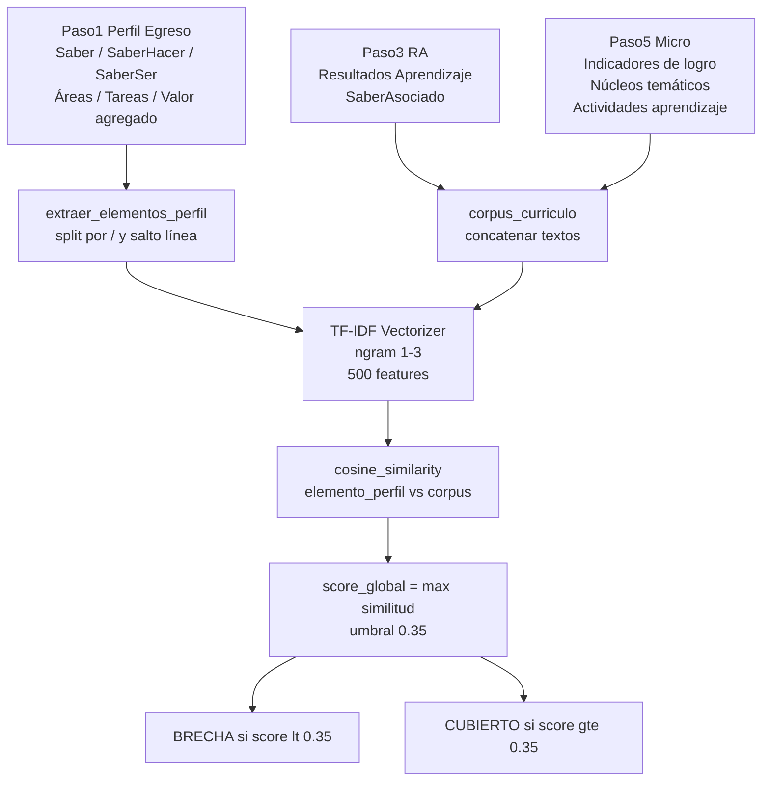

# Plan de Implementación — Sistema de Análisis Microcurricular v2.0

## 1. PROJECT CHARTER

### Visión del producto
El Sistema de Análisis Microcurricular v2.0 automatiza la evaluación de calidad curricular de 50+ programas académicos, detectando brechas en el perfil de egreso, núcleos temáticos de bajo valor y divergencias entre sedes, entregando reportes accionables para coordinadores académicos e instancias de acreditación.

### Objetivos SMART

| # | Objetivo | Métrica | Plazo |
|---|----------|---------|-------|
| O1 | Corregir pipeline de extracción de Paso5 | 0 errores de columna en 50 archivos | Sprint 1 (sem 1) |
| O2 | Filtrar núcleos temáticos inválidos | Precisión ≥ 85%, recall ≥ 90% sobre corpus real | Sprint 2 (sem 2) |
| O3 | Implementar análisis de cobertura del perfil de egreso | Score de cobertura calculado para 100% de programas | Sprint 3 (sem 3) |
| O4 | Detectar asignaturas compartidas y divergencias inter-sede | Matriz de similitud generada para 50×50 programas | Sprint 4 (sem 4) |
| O5 | Excel maestro consolidado con 15 hojas | Generado en < 60 s para corpus completo, peso < 10 MB | Sprint 4 (sem 4) |

### Alcance

**Incluido:**
- Corrección de `EXPECTED_COLUMNS` y pipeline de extracción
- Módulos: `nucleos_cleaner.py`, `perfil_coverage_analyzer.py`, `shared_subjects_analyzer.py`, `topic_modeler.py`
- Análisis de divergencia inter-sede (PBOG/VNAL/PMED/HMED/HBOG)
- Análisis de bloques curriculares (`B.Institucional`, `B.Disciplinar`, `B.Electivo`)
- Análisis de carga horaria (HTD/HTI por semestre)
- Activación del clustering aglomerativo ya importado
- Excel maestro de 15 hojas y dashboard Streamlit actualizado

**Excluido:**
- Migración a base de datos (el proyecto permanece file-based)
- API REST o interfaz web nueva
- Integración con LLM (ya está en config pero es `LLM_ENABLED: False`)
- Scraping de datos externos (LinkedIn, SENA)
- Soporte multi-usuario / autenticación

### Stakeholders

| Rol | Persona | R | A | C | I |
|-----|---------|---|---|---|---|
| Desarrollador / Analista | Usuario del proyecto | R | A | - | - |
| Coordinadores académicos | Consumidores del reporte | - | - | C | I |
| Instancias de acreditación | Destinatarios finales | - | - | - | I |

### Criterios de éxito cuantificables
- Pipeline procesa 50 archivos sin errores de columna en < 5 min
- Tasa de rechazo de núcleos entre 5% y 25% (fuera de ese rango → revisar umbrales)
- Score de cobertura del perfil calculado para cada uno de los 11 campos de Paso1
- Similitud inter-sede del mismo programa detectada en ≥ 90% de los casos donde existe
- El Excel maestro se abre correctamente en Excel/LibreOffice sin errores de formato

---

## 2. PRODUCT BACKLOG

### Épica 1 — Correcciones Críticas de Base (MUST HAVE)

```
EP-01: Corregir pipeline de extracción para que refleje columnas reales
```

| ID | User Story | SP | MoSCoW |
|----|------------|----|--------|
| US-01 | Como analista quiero que el extractor lea correctamente el Paso5 para no perder columnas como `Actividades de aprendizaje` | 3 | Must |
| US-02 | Como analista quiero extraer el Paso1 (Perfil de Egreso) desde `extractor.py` para tenerlo disponible en el pipeline | 5 | Must |
| US-03 | Como analista quiero que el código de sede/modalidad se extraiga del nombre del archivo para segmentar análisis | 2 | Must |
| US-04 | Como analista quiero que los núcleos de celda multi-ítem se tokenicen antes de filtrar para no rechazar bloques válidos | 3 | Must |
| US-05 | Como analista quiero que `HEADER_ROWS` esté correctamente sincronizado con la fila real de headers en los Excel | 1 | Must |

**Criterios de aceptación US-01 (Gherkin):**
```gherkin
Given un archivo FormatoRA_ContPub_PBOG.xlsx procesado con ExcelExtractor
When se llama extract_estrategias_micro()
Then el DataFrame resultante debe contener las columnas:
  'Tipología', 'B.Institucional', 'B.Disciplinar', 'B.Electivo',
  'Actividades de aprendizaje', 'Actividades de evaluación',
  'Indicadores de logro asignatura o módulo'
And no debe contener columnas 'Unnamed'
And debe tener al menos 1 fila de datos
```

**Criterios de aceptación US-02:**
```gherkin
Given un archivo Excel en data/raw/FORMATOS RA CICLO UNO RC/
When se llama extractor.extract_perfil_egreso()
Then el DataFrame debe contener exactamente 11 columnas:
  Programa, Modalidad, Perfil profesional, Perfil ocupacional,
  Saber, SaberHacer, SaberSer, Áreas profesionales,
  Tareas profesionales, Poblaciones actuación, Valor agregado
And el campo 'Programa' no debe ser nulo
```

---

### Épica 2 — Limpieza de Núcleos Temáticos (MUST HAVE)

```
EP-02: Módulo nucleos_cleaner.py con pipeline NLP en español
```

| ID | User Story | SP | MoSCoW |
|----|------------|----|--------|
| US-06 | Como analista quiero que núcleos inválidos como "Expansión A", "Salgamos" sean descartados con razón auditable | 5 | Must |
| US-07 | Como analista quiero un score académico 0-1 por núcleo para priorizar cuáles revisar manualmente | 3 | Should |
| US-08 | Como analista quiero detección de anomalías con Isolation Forest para capturar ruido no previsto en patrones regex | 5 | Should |
| US-09 | Como analista quiero deduplicación semántica de núcleos similares entre programas | 5 | Could |
| US-10 | Como analista quiero que los núcleos rechazados se guarden en hoja separada del Excel con su razón de rechazo | 2 | Must |

**Nota técnica:** `dashboard_tematico.py` ya implementa `_limpiar_nucleo()` (línea 63) y `_es_nucleo_valido()` (línea 70) con lógica parcial. El nuevo módulo `src/nucleos_cleaner.py` debe **reutilizar y extender** esa lógica, no reimplementarla.

**Criterios de aceptación US-06:**
```gherkin
Given el corpus completo de Núcleos temáticos de 50 programas tokenizado
When se aplica es_nucleo_valido() a cada sub-ítem
Then "Expansión A", "Expansión B", "Salgamos", "Estrella de Rock" son rechazados
And "Análisis financiero de estados contables" es aceptado
And "Fundamentación teórica y técnica contable" es aceptado
And la tasa total de rechazo está entre 5% y 25%
```

---

### Épica 3 — Análisis de Cobertura del Perfil de Egreso (MUST HAVE)

```
EP-03: Módulo perfil_coverage_analyzer.py
```

| ID | User Story | SP | MoSCoW |
|----|------------|----|--------|
| US-11 | Como coordinador quiero ver qué elementos del Saber/SaberHacer/SaberSer tienen cobertura curricular para identificar brechas | 8 | Must |
| US-12 | Como coordinador quiero un score global de cobertura del perfil por programa para comparar entre sedes | 5 | Must |
| US-13 | Como coordinador quiero que el análisis use `SaberAsociado` del Paso3 (no solo RA completos) para mayor precisión semántica | 3 | Should |
| US-14 | Como coordinador quiero recomendaciones automáticas cuando la cobertura global < 40% | 3 | Should |
| US-15 | Como coordinador quiero una matriz elemento×tipo_curriculo exportable a Excel | 5 | Must |

**Criterios de aceptación US-11:**
```gherkin
Given el perfil de egreso de ContPub_PBOG con campos Saber, SaberHacer, SaberSer
And el corpus curricular (RA + SaberAsociado + Indicadores + Núcleos) del mismo programa
When se ejecuta analizar_cobertura_perfil_completa()
Then cada elemento del perfil tiene un score de cobertura entre 0 y 1
And los elementos con score < 0.35 son clasificados como 'BRECHA'
And el resultado incluye 'recomendaciones' cuando hay > 5 brechas
```

---

### Épica 4 — Análisis Inter-Sede y Asignaturas Compartidas (SHOULD HAVE)

```
EP-04: Módulo shared_subjects_analyzer.py + análisis de divergencia inter-sede
```

| ID | User Story | SP | MoSCoW |
|----|------------|----|--------|
| US-16 | Como directivo quiero ver la similitud curricular entre la misma carrera en distintas sedes (PBOG vs VNAL) | 8 | Should |
| US-17 | Como directivo quiero identificar asignaturas con ≥ 95% de similitud entre programas distintos como candidatas a unificación | 5 | Should |
| US-18 | Como directivo quiero ver las asignaturas con el mismo nombre exacto en múltiples programas | 2 | Should |
| US-19 | Como directivo quiero una hoja Excel con pares de asignaturas similares y su recomendación (unificar/homologar/coordinar) | 3 | Should |
| US-20 | Como analista quiero que el análisis inter-sede sea el primer paso del módulo (antes de comparar programas distintos) | 3 | Should |

---

### Épica 5 — Análisis de Bloques y Carga Horaria (SHOULD HAVE)

```
EP-05: Aprovechar columnas B.Institucional, B.Disciplinar, B.Electivo, horas HTD/HTI
```

| ID | User Story | SP | MoSCoW |
|----|------------|----|--------|
| US-21 | Como coordinador quiero ver la distribución de créditos por bloque curricular (Institucional/Disciplinar/Electivo) por programa | 5 | Should |
| US-22 | Como coordinador quiero detectar programas sin asignaturas electivas (B.Electivo siempre vacío) | 2 | Should |
| US-23 | Como analista quiero ver el ratio HTD/HTI por semestre para detectar sobrecarga o desequilibrio de autonomía | 5 | Could |
| US-24 | Como analista quiero verificar que la tipología de actividades evaluativas es coherente con el TipoSaber declarado | 8 | Could |
| US-25 | Como directivo quiero un mapa de calor Semestre × TipoSaber con carga horaria total para detectar desbalances | 5 | Could |

---

### Épica 6 — ML Avanzado: Clustering y Topic Modeling (COULD HAVE)

```
EP-06: Activar clustering aglomerativo + implementar LDA
```

| ID | User Story | SP | MoSCoW |
|----|------------|----|--------|
| US-26 | Como analista quiero agrupar programas en familias curriculares usando clustering jerárquico sobre indicadores existentes | 5 | Could |
| US-27 | Como analista quiero un score de silhouette para validar la calidad del clustering | 2 | Could |
| US-28 | Como analista quiero descubrir tópicos latentes en el corpus de SaberAsociado con LDA | 8 | Could |
| US-29 | Como analista quiero una nueva página en el dashboard Streamlit "Familias Curriculares" con dendrograma | 8 | Could |
| US-30 | Como analista quiero el "fingerprint diferencial" TF-IDF de cada programa (términos únicos) | 5 | Could |

---

### Épica 7 — Excel Maestro Consolidado (MUST HAVE)

```
EP-07: report_generator.py actualizado con 15 hojas
```

| ID | User Story | SP | MoSCoW |
|----|------------|----|--------|
| US-31 | Como coordinador quiero un Excel único con todos los análisis organizados en hojas numeradas | 8 | Must |
| US-32 | Como coordinador quiero la hoja de Núcleos Válidos con score académico visible | 3 | Must |
| US-33 | Como coordinador quiero la hoja de Brechas del Perfil filtrable por programa y categoría | 3 | Must |
| US-34 | Como coordinador quiero la hoja de Asignaturas Idénticas entre programas | 3 | Should |
| US-35 | Como coordinador quiero que el Excel pese < 10 MB para 50 programas | 2 | Must |

---

### Épica 8 — Calidad de Código y Deuda Técnica (SHOULD HAVE)

```
EP-08: Limpieza de scripts debug y consolidación del proyecto
```

| ID | User Story | SP | MoSCoW |
|----|------------|----|--------|
| US-36 | Como desarrollador quiero eliminar los 15+ scripts debug_*.py de la raíz para tener un proyecto limpio | 1 | Should |
| US-37 | Como desarrollador quiero que config.py tenga los parámetros nuevos (umbrales, contaminación IF, etc.) centralizados | 2 | Must |
| US-38 | Como desarrollador quiero que todos los módulos nuevos tengan tests unitarios básicos en tests/ | 8 | Should |
| US-39 | Como desarrollador quiero que requirements.txt esté actualizado con spacy, networkx | 1 | Must |
| US-40 | Como desarrollador quiero un README actualizado con instrucciones de ejecución del pipeline completo | 2 | Should |

---

## 3. ROADMAP TÉCNICO

### Sprint 0 (Días 1-3) — Setup y Correcciones de Base

**Objetivo:** Pipeline funcional con columnas reales. Sin esto, nada más es posible.

Archivos a modificar:
- [`config.py`](config.py) — `EXPECTED_COLUMNS['ESTRATEGIAS_MICRO']` y añadir `EXPECTED_COLUMNS['PERFIL_EGRESO']`
- [`src/extractor.py`](src/extractor.py) — añadir `extract_perfil_egreso()` y `_extract_sede_modalidad()`
- `requirements.txt` — añadir `spacy>=3.7`, `networkx>=3.0`

Corrección crítica en `config.py`:

```python
# REEMPLAZAR bloque ESTRATEGIAS_MICRO:
'ESTRATEGIAS_MICRO': [
    'Tipo de Saber',
    'Resultado de aprendizaje',        # ← era 'Estrategias de enseñanza aprendizaje'
    'Semestre',
    'Nombre asignatura o módulo',
    'Indicadores de logro asignatura o módulo',  # ← era 'Indicadores de logro'
    'Tipología',
    'B.Institucional', 'B.Disciplinar', 'B.Electivo',
    'Créditos',
    'Número de horas trabajo directo',
    'Número de horas trabajo independiente',
    'Total de horas',
    'Núcleos temáticos',
    'Actividades de aprendizaje',      # ← era 'Estrategias de enseñanza aprendizaje'
    'Actividades de evaluación',       # ← columna nueva (no estaba)
    'Acciones de retroalimentación'
],
'PERFIL_EGRESO': [                     # ← bloque nuevo
    'Programa', 'Modalidad', 'Perfil profesional', 'Perfil ocupacional',
    'Saber', 'SaberHacer', 'SaberSer',
    'Áreas profesionales', 'Tareas profesionales',
    'Poblaciones actuación', 'Valor agregado'
]
```

Nuevo método en `src/extractor.py`:

```python
def _extract_sede_modalidad(self) -> dict:
    """
    Extrae código de sede y modalidad desde el nombre del archivo.
    FormatoRA_ContPub_PBOG.xlsx → {'sede': 'Bogotá', 'modalidad': 'Presencial', 'codigo': 'PBOG'}
    """
    CODIGOS = {
        'PBOG': {'sede': 'Bogotá', 'modalidad': 'Presencial'},
        'VNAL': {'sede': 'Nacional', 'modalidad': 'Virtual'},
        'PMED': {'sede': 'Medellín', 'modalidad': 'Presencial'},
        'HMED': {'sede': 'Medellín', 'modalidad': 'Híbrido'},
        'HBOG': {'sede': 'Bogotá', 'modalidad': 'Híbrido'},
    }
    match = re.search(r'_([A-Z]{4})(?:\.xlsx)?$', self.file_path.stem)
    codigo = match.group(1) if match else 'UNKN'
    return {'codigo': codigo, **CODIGOS.get(codigo, {'sede': 'N/A', 'modalidad': 'N/A'})}

def extract_perfil_egreso(self) -> pd.DataFrame:
    """Extrae perfil de egreso de 'Paso1 Analisis perfil egreso' (header en fila 1)."""
    sheet_name = EXCEL_SHEETS['PERFIL_EGRESO']
    expected_cols = EXPECTED_COLUMNS['PERFIL_EGRESO']
    df = self._read_sheet_as_dataframe(sheet_name, header_row=1,
                                        expected_columns=expected_cols)
    df['Programa_Archivo'] = self.programa_nombre
    df['Sede'] = self._extract_sede_modalidad()['sede']
    df['Modalidad_Archivo'] = self._extract_sede_modalidad()['modalidad']
    df['Codigo_Sede'] = self._extract_sede_modalidad()['codigo']
    return df
```

---

### Sprint 1 (Días 4-7) — Núcleos Temáticos Limpios

**Objetivo:** `src/nucleos_cleaner.py` funcional, integrado en `dashboard_tematico.py`.

**Decisión de diseño:** Reutilizar `_limpiar_nucleo()` y `_es_nucleo_valido()` de `dashboard_tematico.py` (líneas 63-80) como base. El nuevo módulo las importa o replica con extensiones NLP.

Archivos nuevos:
- `src/nucleos_cleaner.py`

Archivos modificados:
- `dashboard_tematico.py` — integrar filtrado en función `analizar_cobertura()`
- `config.py` — añadir bloque `NUCLEOS_CONFIG`

Estructura de `src/nucleos_cleaner.py`:

```python
# Funciones públicas del módulo (interfaz mínima):
def tokenizar_nucleo_celda(texto_celda: str) -> list[str]
    # Separa "1. tema\n2. tema" en ['tema', 'tema']
    # Regex: r'\n\s*\d+[\.\)]\s*|\t\s*\d+[\.\)]\s*'

def es_nucleo_valido(texto: str) -> tuple[bool, str]
    # Retorna (valido, razon_rechazo)
    # Filtros en cascada: longitud → patrones regex → stopwords → NLP (spacy)

def calcular_score_academico(texto: str) -> float
    # Score 0-1 basado en keywords positivos/negativos

def filtrar_nucleos_dataframe(df, columna='Núcleos temáticos') -> pd.DataFrame
    # Aplica tokenizar + filtrar, devuelve df con columnas adicionales

def detectar_anomalias_nucleos(series: pd.Series, contamination=0.15) -> pd.Series
    # Isolation Forest sobre TF-IDF (requiere ≥ 10 muestras)
```

---

### Sprint 2 (Días 8-12) — Análisis de Cobertura del Perfil

**Objetivo:** `src/perfil_coverage_analyzer.py` produciendo scores y brechas por programa.

Archivos nuevos:
- `src/perfil_coverage_analyzer.py`

Archivos modificados:
- `run_analysis.py` — integrar `extract_perfil_egreso()` y `analizar_cobertura_perfil_completa()`

**Corpus para el análisis de cobertura (columnas reales):**

```python
COLUMNAS_CURRICULO_REALES = {
    'Paso3': ['Resultados Aprendizaje', 'SaberAsociado'],  # SaberAsociado es el más preciso
    'Paso5': [
        'Indicadores de logro asignatura o módulo',
        'Núcleos temáticos',
        'Actividades de aprendizaje',
    ]
}

COLUMNAS_PERFIL_REALES = [
    'Saber', 'SaberHacer', 'SaberSer',
    'Áreas profesionales', 'Tareas profesionales', 'Valor agregado'
]
```

**Flujo de datos:**



---

### Sprint 3 (Días 13-17) — Asignaturas Compartidas e Inter-Sede

**Objetivo:** `src/shared_subjects_analyzer.py` con análisis intra-sede primero.

Archivos nuevos:
- `src/shared_subjects_analyzer.py`

**Orden de análisis (ajuste al prompt original):**

```python
def detectar_asignaturas_compartidas(df_micro_todos: pd.DataFrame) -> dict:
    # PASO 1: Comparar mismo programa en distintas sedes
    #   ContPub_PBOG vs ContPub_HMED vs ContPub_VNAL
    #   → Score de "consistencia curricular inter-sede"
    
    # PASO 2: Comparar entre programas distintos
    #   ContPub vs AdmonEmpresas → pares idénticos/similares
    
    # Columnas reales a usar:
    #   'Nombre asignatura o módulo'      (identificador)
    #   'Indicadores de logro asignatura o módulo'  (contenido)
    #   'Núcleos temáticos'               (contenido)
    #   'Resultado de aprendizaje'        (contexto en Paso5)
    #   'Créditos'                        (metadato)
```

---

### Sprint 4 (Días 18-21) — Excel Maestro + ML Avanzado

**Objetivo:** Reporte consolidado funcional + clustering activado.

Archivos modificados:
- `src/report_generator.py` — añadir método `generate_excel_maestro()`
- `dashboard_tematico.py` — añadir página "Familias Curriculares"

Archivos nuevos:
- `src/topic_modeler.py` — LDA sobre corpus `SaberAsociado`

**Estructura del Excel maestro (15 hojas):**

```
01_Resumen_Ejecutivo         ← KPIs por programa + sede + modalidad
02_Competencias              ← Todas las competencias
03_RA_Completo               ← RA con TipoSaber, Verbo, Nivel Dominio (del Paso3 directo)
04_Nucleos_Validos           ← Núcleos filtrados con score académico
05_Nucleos_Rechazados        ← Descartados con razón de rechazo
06_Cobertura_Perfil_Egreso   ← Score por elemento y programa
07_Brechas_Perfil            ← Elementos sin cobertura
08_Divergencia_Inter_Sede    ← NUEVO: mismo programa en sedes distintas
09_Asignaturas_Identicas     ← Pares similitud ≥ 95%
10_Asignaturas_Similares     ← Pares 60-95%
11_Bloques_Curriculares      ← NUEVO: distribución B.Institucional/Disciplinar/Electivo
12_Carga_Horaria             ← NUEVO: HTD/HTI por semestre y programa
13_Bloom_Distribucion        ← Usando Nivel Dominio del Paso3 directamente
14_Tematicas_Emergentes      ← 10 temáticas por programa
15_Alertas_y_Recomendaciones ← Alertas priorizadas
```

---

## 4. ANÁLISIS DE RIESGOS

### Matriz de Riesgos (Probabilidad × Impacto)

```
IMPACTO
5 │         R3    R1
4 │    R5         R2
3 │ R9  R7   R4
2 │    R8   R6   R10
1 │──────────────────
   1    2    3    4    5  PROBABILIDAD
```

| ID | Riesgo | Prob | Imp | Score | Mitigación |
|----|--------|------|-----|-------|------------|
| R1 | Hojas con nombres distintos a los configurados en `EXCEL_SHEETS` en algunos archivos | 4 | 5 | 20 | Implementar detección fuzzy de hoja por nombre parcial antes del acceso directo |
| R2 | `Paso1` con múltiples filas de datos por programa (separadores "/") rompe el parser | 3 | 4 | 12 | Implementar `split_campo_multiple()` que separe por `/`, `\n`, `•`, `–` |
| R3 | spaCy `es_core_news_sm` no instalado en entorno de producción | 4 | 5 | 20 | Hacer spaCy opcional con flag `USE_SPACY=False` en `config.py`; fallback a regex puro |
| R4 | TF-IDF sobre corpus pequeño (programas con < 10 RA) da similitudes infladas | 3 | 3 | 9 | Usar `min_df=1` y agregar umbral mínimo de tamaño de corpus antes de vectorizar |
| R5 | Tasa de rechazo de núcleos > 25% (umbrales demasiado agresivos) | 2 | 4 | 8 | Ejecutar `dry_run` sobre corpus completo antes de integrar; ajustar `MIN_LONGITUD` |
| R6 | Isolation Forest requiere ≥ 10 muestras; programas pequeños rompen el módulo | 3 | 2 | 6 | Guard clause: si `len(corpus) < 10`, retornar `[False] * len(series)` |
| R7 | `B.Institucional`/`B.Disciplinar`/`B.Electivo` son strings ("X", "✓") no booleanos | 3 | 3 | 9 | Normalizar a bool con `pd.notna(val) and str(val).strip() not in ('', 'nan', 'None')` |
| R8 | Excel maestro > 10 MB por serializar matrices de similitud 50×50 | 2 | 2 | 4 | Limitar hoja `Matriz_Similitud` a pares con similitud > umbral (lista, no matriz full) |
| R9 | `Número de horas trabajo directo` tiene valores nulos o string en algunos archivos | 4 | 3 | 12 | Usar `pd.to_numeric(..., errors='coerce')` en todos los campos numéricos del Paso5 |
| R10 | Archivos con hoja `Paso 3 Redacción RA - Backup` confunde al extractor | 2 | 2 | 4 | Filtrar hojas con 'Backup' en `_read_sheet_as_dataframe` |

---

## 5. DEFINICIÓN DE ACUERDOS

### Definition of Done (DoD) — 10 ítems

- [ ] El módulo tiene función de `__main__` con ejemplo mínimo que corre sin errores
- [ ] Todas las columnas usadas usan los nombres reales del Excel (no los del prompt original)
- [ ] Los DataFrames resultantes no tienen columnas `Unnamed`
- [ ] El módulo tiene guard clauses para corpus vacío o con < 10 filas
- [ ] Los parámetros configurables están centralizados en `config.py` (no hardcodeados)
- [ ] La función principal produce al menos 1 artefacto (DataFrame, Excel o dict serializable)
- [ ] El módulo está importado y ejecutado desde `run_analysis.py`
- [ ] No hay `print()` de debug sin condición; usar `logger.info/warning/error`
- [ ] Probado sobre mínimo 3 archivos distintos (1 pregrado, 1 especialización, 1 tecnología)
- [ ] La hoja Excel correspondiente se genera sin errores con openpyxl

### Definition of Ready (DoR) — 7 ítems

- [ ] La user story tiene criterios de aceptación en formato Gherkin
- [ ] Las columnas reales que usa el módulo están verificadas contra los Excel
- [ ] Se conoce el módulo existente con el que puede haber duplicación de lógica
- [ ] El parámetro configurable correspondiente existe o se planificó en `config.py`
- [ ] El caso de corpus vacío está contemplado en los criterios de aceptación
- [ ] Las dependencias externas nuevas (spaCy, networkx) están en `requirements.txt`
- [ ] El artefacto de salida (DataFrame, Excel, dict) está especificado con sus columnas

### Branching Strategy

Dado que es desarrollo individual, se usa **Trunk-Based Development simplificado**:

```
main (estable)
  └── feature/sprint-0-correcciones-base
  └── feature/sprint-1-nucleos-cleaner
  └── feature/sprint-2-perfil-coverage
  └── feature/sprint-3-shared-subjects
  └── feature/sprint-4-excel-maestro
```

- Commit mínimo por unidad funcional completada (1 función pública = 1 commit)
- PR a `main` solo cuando la DoD está 100% cumplida
- Tag semántico: `v2.0.0-sprint0`, `v2.0.0-sprint1`, etc.

### Convenciones de Código

```
Módulos src/:      snake_case.py          (nucleos_cleaner.py)
Clases:            PascalCase             (NucleosCleaner, PerfilCoverageAnalyzer)
Funciones públicas: snake_case()          (filtrar_nucleos_dataframe)
Funciones privadas: _snake_case()         (_calcular_tfidf_interno)
Constantes:        UPPER_SNAKE_CASE       (UMBRAL_COBERTURA = 0.35)
DataFrames:        prefijo df_            (df_nucleos, df_perfil)
Parámetros config: centralizados en config.py, nunca hardcodeados en módulos

Imports — orden obligatorio:
1. stdlib (re, os, unicodedata, collections)
2. third-party (pandas, numpy, sklearn, spacy)
3. proyecto (from config import ..., from src.extractor import ...)
```

---

## 6. ARCHITECTURE DECISION RECORDS (ADRs)

### ADR-01: Uso de spaCy como dependencia opcional

**Contexto:** spaCy mejora el filtrado de núcleos (detección POS), pero requiere descarga de modelo (~50 MB) y puede no estar disponible en entornos restringidos.

**Decisión:** spaCy es opcional. Si `USE_SPACY=True` en `config.py` y el modelo está instalado, se activa el Filtro 5 (POS). Si no, los filtros 1-4 (regex + longitud + stopwords) son suficientes para el 90% de los casos.

**Consecuencia:** `nucleos_cleaner.py` detecta spaCy en tiempo de importación con `try/except ImportError` y expone la constante `SPACY_DISPONIBLE`.

### ADR-02: SaberAsociado como corpus primario para cobertura de perfil

**Contexto:** Los RA completos son frases largas con estructura verbal; `SaberAsociado` contiene el saber específico en forma de sustantivos (ej: "Principios económicos y sociales, y normatividad empresarial"), que se alinea directamente con los elementos del perfil.

**Decisión:** El análisis de cobertura usa `SaberAsociado` con peso doble en el corpus, complementado con `Indicadores de logro asignatura o módulo` y `Núcleos temáticos`.

### ADR-03: Análisis inter-sede como prioridad sobre análisis inter-programa

**Contexto:** El prompt original propone comparar programas distintos entre sí. Los datos revelan que hay 3 versiones de ContPub (PBOG/HMED/VNAL), 3 de IngIndustrial, etc.

**Decisión:** `shared_subjects_analyzer.py` ejecuta primero la comparación intra-programa (mismo código de carrera, distintas sedes) y luego la inter-programa. El resultado de intra-sede es la métrica de "consistencia curricular" más valiosa estratégicamente.

### ADR-04: Nivel de Bloom desde Nivel Dominio del Paso3 (no inferencia por verbo)

**Contexto:** `analyzer.py` infiere el nivel de Bloom desde el verbo del RA buscándolo en `TAXONOMIA_BLOOM`. Los archivos ya tienen clasificada la taxonomía en el campo `Nivel Dominio` (valores como "AnálisisBAK", "ControlBAK", "ValorarBAK").

**Decisión:** Usar `Nivel Dominio` como fuente primaria y el lookup por verbo como fallback. Esto elimina errores de inferencia y simplifica `_get_nivel_taxonomico()`.

### ADR-05: Excel maestro como artefacto principal (no dashboard únicamente)

**Contexto:** Los coordinadores académicos consumen los resultados fuera de Streamlit.

**Decisión:** El Excel maestro de 15 hojas es el artefacto entregable principal de `run_analysis.py`. El dashboard Streamlit es la capa de exploración interactiva secundaria. Los dos comparten los mismos DataFrames generados por `run_analysis.py`.

---

## 7. PLAN DE CALIDAD Y DEUDA TÉCNICA

### Deuda técnica existente identificada

| ID | Descripción | Área | Impacto | Esfuerzo | Prioridad | Sprint |
|----|-------------|------|---------|----------|-----------|--------|
| DT-01 | `EXPECTED_COLUMNS['ESTRATEGIAS_MICRO']` con nombres incorrectos | `config.py` | Alto | 1h | P0 | Sprint 0 |
| DT-02 | `extract_all()` no extrae Paso1 | `src/extractor.py` | Alto | 2h | P0 | Sprint 0 |
| DT-03 | 15+ scripts `debug_*.py` en raíz | Raíz | Medio | 1h | P2 | Sprint 4 |
| DT-04 | `_limpiar_nucleo()` duplicada entre `dashboard_tematico.py` y el nuevo módulo | `src/` | Medio | 2h | P1 | Sprint 1 |
| DT-05 | `_get_nivel_taxonomico()` ignora `Nivel Dominio` como fuente primaria | `src/analyzer.py` | Bajo | 1h | P2 | Sprint 2 |
| DT-06 | No hay tests para ningún módulo de `src/` | `tests/` | Alto | 8h | P1 | Sprint 3-4 |
| DT-07 | `HEADER_ROWS` de Paso4 incorrecto (el header real está en fila 2, no 0) | `config.py` | Bajo | 0.5h | P1 | Sprint 0 |

### Checklist de Code Review (para cada módulo nuevo)

- [ ] Nombres de columnas verificados contra `EXPECTED_COLUMNS` real (no el del prompt)
- [ ] Guard clause para DataFrame vacío o Series vacía en cada función pública
- [ ] Todos los parámetros numéricos referenciados desde `config.py`
- [ ] Manejo de errores explícito: `try/except Exception as e: logger.error(...)` no catch vacío
- [ ] Probado con `FormatoRA_AdmonEmpresas_PBOG.xlsx`, `FormatoRA_ContPub_PBOG.xlsx`, `FormatoRA_IngSistemas_PBOG.xlsx`
- [ ] No `print()` sueltos (solo `logger`)
- [ ] La función `filtrar_nucleos_dataframe()` no modifica el DataFrame original (usar `.copy()`)
- [ ] `pd.to_numeric(..., errors='coerce')` en todos los campos numéricos del Paso5

### Performance baseline

- El pipeline completo (50 archivos) debe correr en < 5 min sin spaCy, < 10 min con spaCy
- Vectorizar 50 programas × 300 núcleos con TF-IDF debe tardar < 30 s
- El Excel maestro debe generarse en < 60 s
